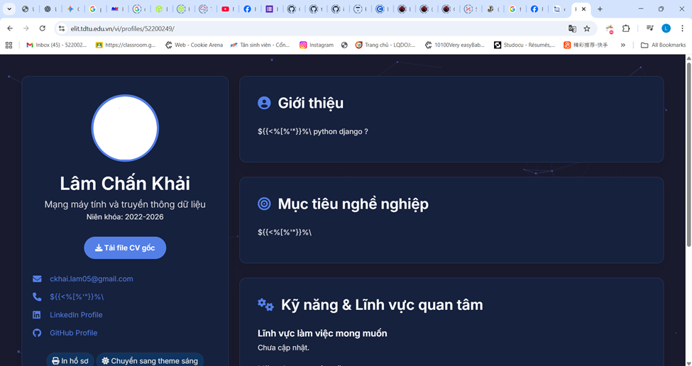

# Elit-bi-xss

Trong lúc đang dọc Elit, thì mình phát hiện ra eilt có 2 tính năng mới là xem và edit profile. Xem qua thì thấy các trường do sinh viên nhập vào sẽ được reflex lên lại trang xem profile nên mình có thử SSTI và XSS, nhưng không được.

  

Trở về lại trang edit mình thấy có một trường cho phép sinh viên up CV với file .pdf.

  

Mình thử với một file .pdf thật. 

  

Sau đó mình có thử với một số file extension khác.
 

  

Up trực tiếp 1 file .png không được. Nên mình sài burpsuite để up lại file .png nhưng thay đổi đuôi file thành pdf, nhưng cũng không được.

  

Lần này mình sẽ thử up 1 file .pdf nhưng mình sẽ thay đổi đuôi file. 

  

Up thành công. Vậy server không thề quan tâm đuôi file mà sinh viên upload lên là gì, có thể nó dùng MIME type hoặc magic bytes để kiểm tra. Sau đó mình thử xss với đuôi .html và xem xem server sẽ trả về content-type là text/plain hay text/html. Nếu nó trả về text/plain thì không thể xss, vì khi đó nếu như có chèn mã js vào thì khi trả về browser sẽ không render nó như 1 trang html mà chỉ hiển thị nội dung raw của file.

  

Vậy là xss thành công, trong mã js chèn vào mình có fetch đến webhook để kiểm tra. 

  

Từ đó có thể lấy được cookie của nạn nhân. Kiểm tra trong cookie của mình thì mình thấy có trường clsroomtool, đây chính là seassion, nhưng tiếc là nó đã được gắn cờ HttpOnly nên mình không thể lấy được nó để cướp phiên làm việc của nạn nhân.

Ở đây mình thấy có trường csrf_token trong cookie của nạn nhân và khi gửi POST đến /edit/ cũng có một trường csrf middleware token, tìm hiểu một chút thì biết được Django sẽ tạo ra một csrf middleware token dựa vào header X-CSRF-TOKEN, nghĩa là bây giờ mình chỉ cần thêm X-CSRF-TOKEN vào header với csrf token lấy được của nạn nhân và xóa đi csrf middleware token ở body để django tự tạo một cái mới thì có thể edit được profile của nạn nhân. Chỉnh sửa lại script một chút và cho một nạn nhân bấm vào link. Lúc này profile của nạn nhân sẽ tự động bị chỉnh sửa.

